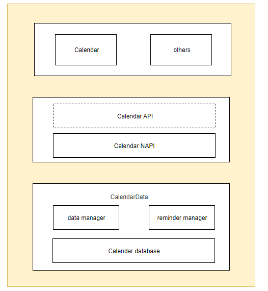
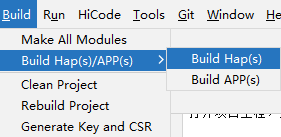
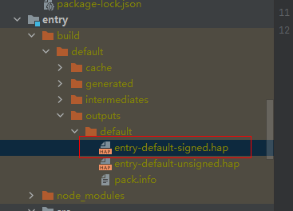
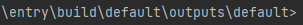

# CalendarData

## 1. Introduction

The calendardata application is a preset application in OpenHarmony that provides the function of adding, deleting, modifying, and checking the schedule

## 2. Directory Structure
```
├─AppScope
│  │  
│  └─resources                       # resource file
├─common
│  │  
│  └─src
│      └─main  
│          └─ets                     # basic methods           
├─datamanager 
│  └─src
│      └─main
│          └─ets                     # data manager                     
├─dataprovider
│  └─src
│      └─main
│          └─ets                     # the proxy of data manager          
├─datastructure 
│  └─src
│      └─main 
│          └─ets                     # data structure               
├─entry
│  └─src
│      └─main                        # the entry of project          
├─rrule
│  └─src
│      └─main
│          └─ets                     # recurrence rule          
└─signature                          # certificate file
```

### Architecture



- **product**
  Business form layer: Distinguish various forms of applications for different products and screens, including personalized business, component configuration, and personalized resource packages。

- **feature**
  Common feature layer: An abstract collection of common feature components that can be referenced by various application forms。

- **common**
  Common capability layer: Basic capability set, modules that each application form must rely on, including tool classes and common resource packages。

## 3. Packaging

Open project engineering by DevEco Studio, choose: Build → Build Haps(s)/APP(s) → Build Hap(s)



After compilation, the HAP package will be generated in the `\build\outputs` path in the project directory (if no signature is configured, only unsigned HAP packages will be generated)



### Install

Install the compiled hap package using the command: hdc_std install "HAP packet address"



## Constraint
- Development Environment
    - **DevEco Studio for OpenHarmony**: Version number greater than 3.1.1.101, Download and Install OpenHarmony SDK API Version 10(The initial IDE configuration can refer to the IDE usage documentation)
- Language
    - ArkTS
- Limitation
    - This example only supports running on standard systems


