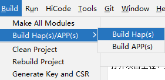

# 日历存储应用

## 项目介绍

日历存储应用是OpenHarmony中预置的应用，提供日程的增删改查功能。

## 目录结构
```
├─AppScope
│  │  
│  └─resources                       # 资源文件 
├─common
│  │  
│  └─src
│      └─main  
│          └─ets                     # 公共方法            
├─datamanager 
│  └─src
│      └─main
│          └─ets                     # 数据处理                     
├─dataprovider
│  └─src
│      └─main
│          └─ets                     # 数据处理代理层         
├─datastructure 
│  └─src
│      └─main 
│          └─ets                     # 数据结构               
├─entry
│  └─src
│      └─main                        # 程序入口          
├─rrule
│  └─src
│      └─main
│          └─ets                     # 重复规则          
└─signature                          # 证书文件目录
```

### 整体架构


Calendar作为内建基础应用，实现日月视图查看、日程创建查看等与用户交互相关的基础操作；Calendar API提供免SQL的对象化数据读写访问能力；CalendarData负责日程管理、提醒管理以及数据管理等功能。
  
## 使用说明

### 基于IDE构建

在DevEco Studio打开项目工程，选择Build → Build Haps(s)/APP(s) → Build Hap(s)。



编译完成后，hap包会生成在工程目录下的 `\build\outputs`路径下。（如果没有配置签名，则只会生成未签名的hap包）


使用hdc_std install "hap包地址" 命令进行安装编译后的hap包。


### 基于OpenHarmony版本构建

在OpenHarmony源码目录下，调用一下命令，单独编译calendar_data

```
./build.sh --product-name rk3568 --ccache --build-target calendar_data
```
> **说明：**
--product-name：产品名称，例如Hi3516DV300、rk3568等。
--ccache：编译时使用缓存功能。
--build-target: 编译的部件名称。

## 约束
- 开发环境
   - **DevEco Studio for OpenHarmony**: 版本号大于3.1.1.101，下载安装OpenHarmony SDK API Version 10。（初始的IDE配置可以参考IDE的使用文档）
- 语言版本
   - ArkTS
- 限制
   - 本示例仅支持标准系统上运行


