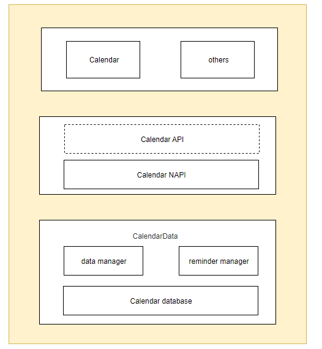

# 日历存储应用

## 1. 项目介绍

日历存储应用是OpenHarmony中预置的应用，提供日程的增删改查功能

## 2. 目录结构
```
├─AppScope
│  │  
│  └─resources                       # 资源文件 
├─common
│  │  
│  └─src
│      └─main  
│          └─ets                     # 公共方法            
├─datamanager 
│  └─src
│      └─main
│          └─ets                     # 数据处理                     
├─dataprovider
│  └─src
│      └─main
│          └─ets                     # 数据处理代理层         
├─datastructure 
│  └─src
│      └─main 
│          └─ets                     # 数据结构               
├─entry
│  └─src
│      └─main                        # 程序入口          
├─rrule
│  └─src
│      └─main
│          └─ets                     # 重复规则          
└─signature                          # 证书文件目录
```

### 整体架构



- **product**
  业务形态层：区分不同产品、不同屏幕的各形态应用，含有个性化业务，组件的配置，以及个性化资源包。

- **feature**
  公共特性层：抽象的公共特性组件集合，可以被各应用形态引用。

- **common**
  公共能力层：基础能力集，每个应用形态都必须依赖的模块，包含工具类和通用的资源包
  
## 3. 打包

在DevEco Studio打开项目工程，选择Build → Build Haps(s)/APP(s) → Build Hap(s)


编译完成后，hap包会生成在工程目录下的 `\build\outputs`路径下（如果没有配置签名，则只会生成未签名的hap包）


### 安装

使用hdc_std install "hap包地址" 命令进行安装编译后的hap包


## 约束
- 开发环境
   - **DevEco Studio for OpenHarmony**: 版本号大于3.1.1.101，下载安装OpenHarmony SDK API Version 10。（初始的IDE配置可以参考IDE的使用文档）
- 语言版本
   - ArkTS
- 限制
   - 本示例仅支持标准系统上运行


